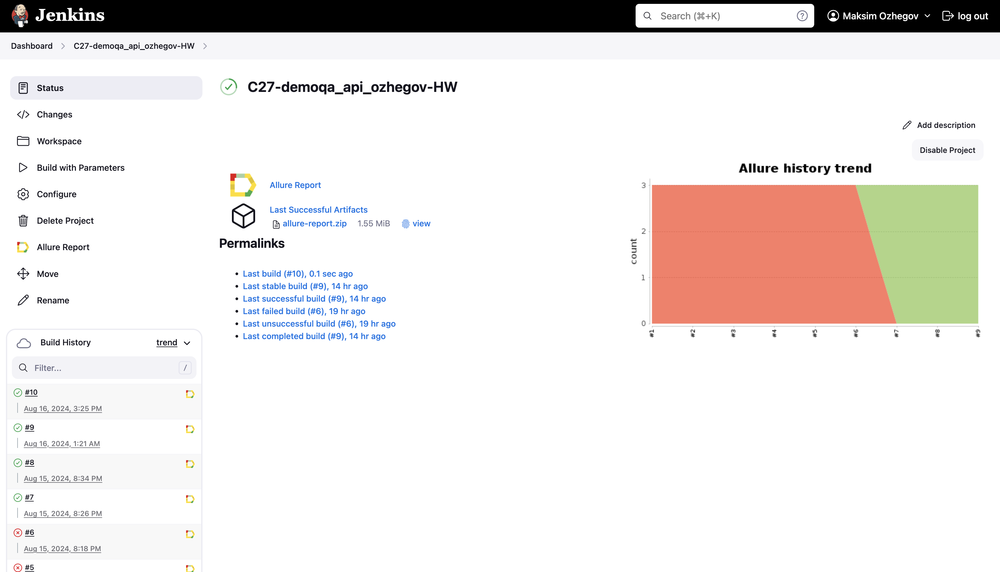
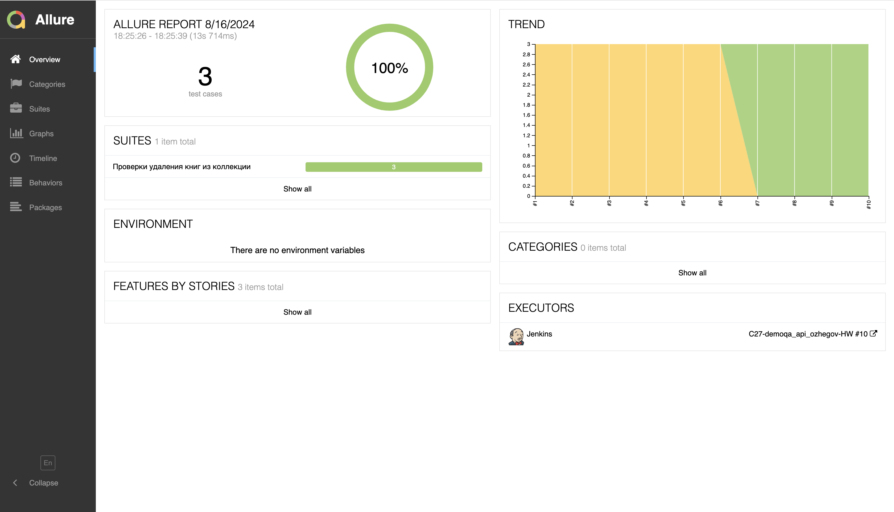
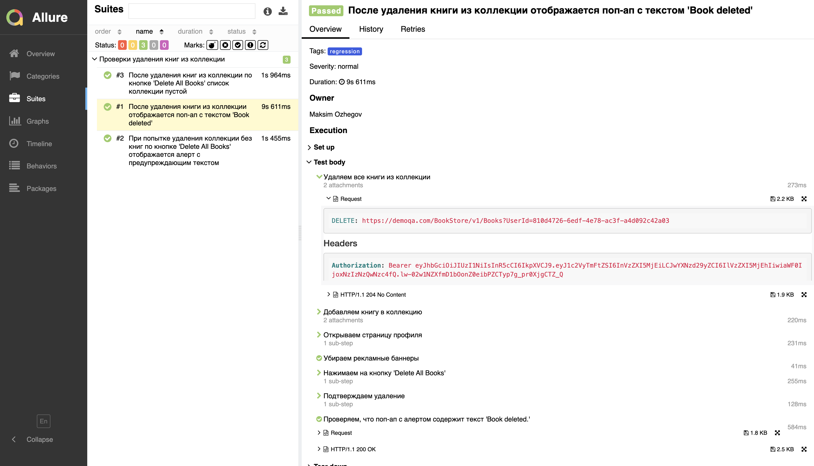
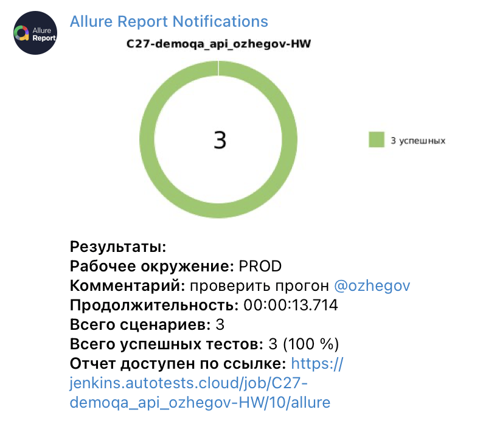

# Автоматизация тестирования UI + API c использованием REST Assured

## <a>**Задача:**</a>
1. Разработать автотесты на удаление книг из [колекции](https://demoqa.com/books)
    1. Авторизация и добавление книг в коллекцию с помощью API запросов с использованием **REST Assured**
       - Реализовать авторизацию с аннотацией **@WithLogin**
       - Реализовать **Lombok** модели
       - Сформировать спецификации ответов и запросов
    2. Осуществление проверок через UI с использованием **Selenide** + **JUnit5**

2. Подключить **Allure Report**:
- Прописать шаги тестов (step)
- Использовать кастомизированные логи
- Добавить скриншоты, логи и видео после выполнения каждого теста

3. Настроить запуск тестов в **Jenkins**:
- Cделать сборку
- Передать адрес удаленного браузера (**Selenoid**)
- Осуществить возможность выбора браузера и разрешения

4. Добавить уведомления о результатах прохождении автотестов с помощью **Telegram-бота**

## </a>Сборка в [Jenkins](https://jenkins.autotests.cloud/job/C27-demoqa_api_ozhegov-HW/)</a>

  
  

## </a>Интеграция с [Allure Report](https://jenkins.autotests.cloud/job/C27-demoqa_api_ozhegov-HW/allure)</a>

### *Основная страница отчёта*

  
  

  

### *Тест-кейсы*

  
  

## </a>Уведомления в Telegram при помощи бота</a>

  
  

